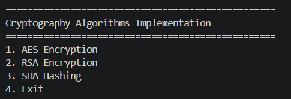
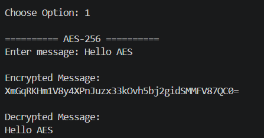
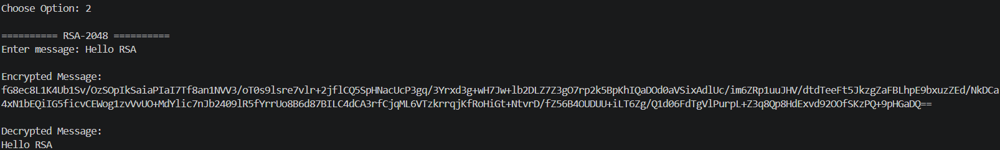
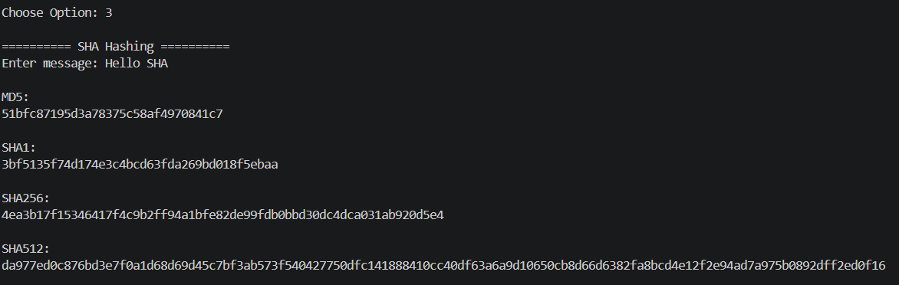

# 🔐 Cryptography Algorithms Implementation

A Python-based cryptography project that demonstrates the implementation of popular cryptographic algorithms including **AES-256**, **RSA-2048**, and **SHA Hashing**. This project provides a simple command-line interface (CLI) for encryption, decryption, hashing, secure key generation, and file integrity verification.

---

## 📌 Project Overview

Cryptography is the foundation of modern cybersecurity. This project implements three widely used cryptographic techniques:

- **AES-256** for symmetric encryption
- **RSA-2048** for asymmetric encryption
- **SHA** for secure hashing and integrity verification

The project is designed to help students and beginners understand how these algorithms work through practical implementation in Python.

---

## ✨ Features

- 🔐 AES-256 Encryption & Decryption
- 🔑 RSA-2048 Public Key Encryption & Decryption
- 🔒 SHA Hashing (MD5, SHA-1, SHA-256, SHA-512)
- 📄 File Encryption using AES
- 📁 File Integrity Verification using SHA-256
- 🔑 Random AES Key Generation
- 🔑 RSA Public & Private Key Generation
- 💻 Interactive Command-Line Interface (CLI)

---

## 🛠 Technologies Used

- Python 3.x
- PyCryptodome
- hashlib
- Git
- GitHub

---

## 📁 Project Structure

```text
Cryptography-Algorithms-Implementation/
│
├── demo/
│   ├── sample.txt
│   ├── sample.enc
│   └── sample_decrypted.txt
│
├── docs/
│
├── keys/
│
├── screenshots/
│   ├── 01_main_menu.png
│   ├── 02_aes_demo.png
│   ├── 03_rsa_demo.png
│   └── 04_sha_demo.png
│
├── src/
│   ├── aes/
│   │   ├── __init__.py
│   │   └── aes_encrypt.py
│   │
│   ├── rsa/
│   │   ├── __init__.py
│   │   └── rsa_encrypt.py
│   │
│   └── sha/
│       ├── __init__.py
│       └── sha_hash.py
│
├── .gitignore
├── LICENSE
├── main.py
├── README.md
├── requirements.txt
├── test_file.py
└── test_hash.py
```

---

# 📷 Screenshots

## 🏠 Main Menu



---

## 🔐 AES Encryption



---

## 🔑 RSA Encryption



---

## 🔒 SHA Hashing



---

## ⚙ Installation

### Clone the Repository

```bash
git clone https://github.com/hamsikamatamsetti-git/Cryptography-Algorithms-Implementation.git
```

### Navigate to Project

```bash
cd Cryptography-Algorithms-Implementation
```

### Create Virtual Environment

```bash
python -m venv venv
```

### Activate Virtual Environment

#### Windows

```bash
venv\Scripts\activate
```

#### Linux / macOS

```bash
source venv/bin/activate
```

### Install Dependencies

```bash
pip install -r requirements.txt
```

---

## ▶ Running the Project

```bash
python main.py
```

---

## 🔒 Supported Algorithms

### AES-256

- Symmetric Encryption
- CBC Mode
- PKCS7 Padding
- Random IV Generation

### RSA-2048

- Public Key Encryption
- Private Key Decryption
- OAEP Padding
- Secure Key Pair Generation

### SHA Hashing

- MD5
- SHA-1
- SHA-256
- SHA-512
- File SHA-256 Hash Verification

---

## 💻 Sample Output

```text
===========================================
Cryptography Algorithms Implementation
===========================================

1. AES Encryption
2. RSA Encryption
3. SHA Hashing
4. Exit

Choose Option:
```

---

## 📚 Learning Outcomes

- Cryptography Fundamentals
- Symmetric Encryption
- Asymmetric Encryption
- Secure Hash Functions
- File Encryption
- Secure Key Management
- Python Package Development
- Git & GitHub Workflow

---

## 🚀 Future Enhancements

- AES-GCM Authenticated Encryption
- RSA Digital Signatures
- Hybrid Encryption (AES + RSA)
- GUI using Tkinter
- Secure Password Manager
- Folder Integrity Checker
- File Encryption with Drag & Drop

---

## 👩‍💻 Author

**Hamsika Matamsetti**

Cybersecurity Enthusiast | Python Developer

GitHub:
https://github.com/hamsikamatamsetti-git

---

## 📄 License

This project is licensed under the **MIT License**.

---

## ⭐ Support

If you found this project useful, consider giving it a ⭐ on GitHub.

